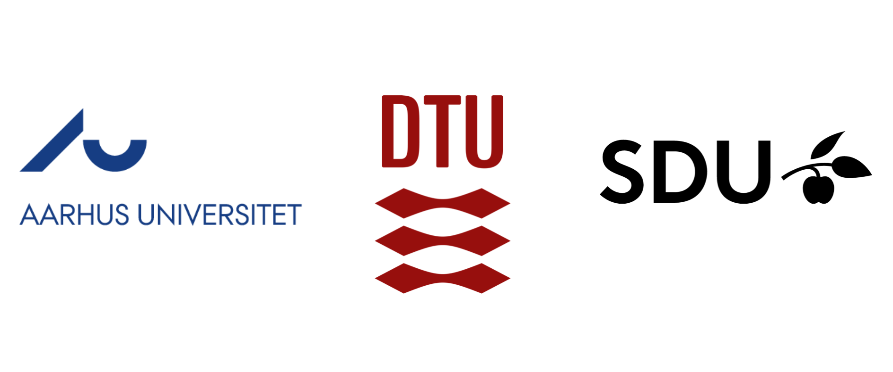

DeiC National Integration Portal
================================

Welcome to the website for the initial workshops of DeiC "Project 5", organized by SDU, AU and DTU.

On this website you will find the materials which have been discussed during the workshops, dates and agendas for the events as well as contact info on all the participants and their affiliations.

Please feel free to leave feedback in the comments section of each workshop (you need to log in to your `GitHub <https://github.com/>`__ account). We will read all comments and collect relevant feedback/issues to be discussed at the workshops. 

Overall Goals and Scope
-----------------------

In Fall 2020, a consortium formed by the Technical University of Denmark (DTU), Aarhus University (AU) and the University of Southern Denmark (SDU) was approved by the DeiC board for the realization of the DeiC "Project 5" for the creation of the **National Integration Portal** system. The purpose of this software project is to drive the development of a shared self-service and dashboard with integration into the national HPC centers and international HPC facilities like the pan-European pre-exascale supercomputer, LUMI. The consortium proposal was to expand UCloud with the necessary new functionality. 

The original call from DeiC for Project 5 can be found `here <_static/DeiC_April_2020.pdf>`__.

Expression of interest Integration Portal can be found `here <_static/Integration_Portal_letter.pdf>`__.

Project 5 Workshops
-------------------

To initiate the works of "Project 5", a series of three workshops will be held in December 2020, on the 3rd, 10th and 17th of December 2020. The purpose of these workshops is to define use-cases, functionalities, requirements, and ultimately define the roadmap and work packages of the DeiC "Project 5". 

On this website you will find materials from the workshops: `workshop 1 <workshop1/index.html>`__, `workshop 2 <workshop2/index.html>`__, and `workshop 3 <workshop3/index.html>`__.

DeiC National HPC Systems
-------------------------

.. table::
    :align: center

    +----------+------------------+
    | DeiC HPC | Hosting Site     |
    +==========+==================+
    |          | AAU - CLAAUDIA   |
    + Type 1   +------------------+
    |          | SDU eScience     |
    +----------+------------------+
    |          | GenomeDK         |
    +          +------------------+
    | Type 2   | Computerome 2    |
    +          +------------------+
    |          | Sophia           |
    +----------+------------------+
    | Type 3   | SDU eScience     |
    +----------+------------------+
    | Type 4   | KU               |
    +----------+------------------+

References
----------

https://www.deic.dk/da/Supercomputere

https://www.deic.dk/da/news/2020-12-10/hpc

https://www.sdu.dk/da/nyheder/aktuelt_fra_sdu/ny-supercomputer-skaber-langt-mere-samfundsvaerdi

https://escience.sdu.dk/index.php/news/new-national-agreement-makes-hpc-available-to-all-kinds-of-researchers/

https://www.lumi-supercomputer.eu/about-lumi/

https://escience.sdu.dk/index.php/ucloud/

.. toctree::
   :maxdepth: 1
   :caption: Contents
   :hidden:

   workshop1/index
   workshop2/index
   workshop3/index

.. .. list-table::
    
..     * -
..       -
..       -

..     * - .. figure:: _static/logo/AU_logo.png
..            :scale: 50%
..            :align: left
..       - .. figure:: _static/logo/DTU_logo.png
..            :scale: 4%
..            :align: center 
..       - .. figure:: _static/logo/SDU_logo.png
..            :scale: 40%
..            :align: left

